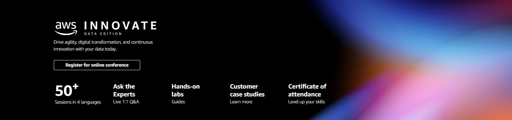

  

The following labs will give you hands-on experience with a number of the topics discussed during the AWS Innovate Data Edition.

ℹ️ **You will run these lab in your own AWS account. Please follow directions at the end of the labs to remove resources to minimize costs.**

These labs will remain available after AWS Innovate Data Edition. **You can do them at any time**, even after AWS Innovate Data Edition.

## [Analyze data with AWS Lake Formation and Amazon QuickSight](https://github.com/phonghuule/Securely-analyze-your-data-with-AWS-Lake-Formation-and-Amazon-QuickSight)

In this lab, we explore the ways in which you can securely store, analyze, and visualize sensitive customer data. We start by storing encrypted sample test data in our Amazon Simple Storage Service (Amazon S3) based data lake. We use AWS Lake Formation to configure fine-grained permissions to restrict user access, and finally analyze the data and visualize business insights using Amazon QuickSight.

Duration: 90 minutes

[View lab instructions](https://github.com/phonghuule/Securely-analyze-your-data-with-AWS-Lake-Formation-and-Amazon-QuickSight)

---

## [Data preparation using Amazon Redshift with AWS Glue DataBrew](https://github.com/phonghuule/Data-preparation-using-Amazon-Redshift-with-AWS-Glue-DataBrew)

In this lab, we use AWS Glue DataBrew to clean data from an Amazon Redshift table, and transform and use different feature engineering techniques to prepare data to build a machine learning (ML) model.

Duration: 90 minutes

[View lab instructions](https://github.com/phonghuule/Data-preparation-using-Amazon-Redshift-with-AWS-Glue-DataBrew)

----

## [Real-time clickstream anomaly detection](https://github.com/phonghuule/Real-Time-Clickstream-Anomaly-Detection-Kinesis-Analytics)

Amazon Kinesis Data Analytics is a managed service that makes it easy to identify and respond to changes in data behavior in real-time. In this lab, we use Amazon Kinesis Data Analytics to detect clickstream anomalies in real-time.

Duration: 120 minutes

[View lab instructions](https://github.com/phonghuule/Real-Time-Clickstream-Anomaly-Detection-Kinesis-Analytics)

---

## [Monitoring operations with Amazon Elasticsearch](https://github.com/phonghuule/Monitoring-Operations-With-Amazon-ElasticSearch)

In this lab, you will understand how to use Amazon ES by actually building a real-time dashboard and performing a full-text search using Amazon ES and related AWS services. The goals of this lab is to provide you a basic knowledge of Amazon EX for future use.

Duration: 90 minutes

[View lab instructions](https://github.com/phonghuule/Monitoring-Operations-With-Amazon-ElasticSearch)

---

## [Text Extraction and Analysis Using Amazon Textract and Amazon Comprehend](http://bit.ly/39GeP60)

In this lab we will extract the features of a text document using Amazon Textract. Then use Amazon Comprehend to analyse the extracted features. We will learn how to connect aws services together using AWS Lambda.

Duration: 30 minutes

[View lab instructions](http://bit.ly/39GeP60)

---

## [Personalized Recommendations](http://bit.ly/3oLnkkt)

In this lab you will learn the basics of how to use Amazon Personalize in order to create a recommendation system. Be aware that the data upload and training steps do take a long period to perform.

Duration: Approximately 90 minutes

[View lab instructions](http://bit.ly/3oLnkkt)

---

## [Sentiment Analysis Web App](http://bit.ly/35NX9Sb)

In this lab, we will demonstrate how to add the AI and ML cloud service feature to your web application with React and the Amplify Framework.

Duration: Approximately 30 minutes

[View lab instructions](http://bit.ly/35NX9Sb)

---

## [Customer Churn Prediction](http://bit.ly/35OfP4e)

This lab describes using machine learning (ML) for the automated identification of unhappy customers, also known as customer churn prediction

Duration: Approximately 60 minutes

[View lab instructions](http://bit.ly/35OfP4e)

